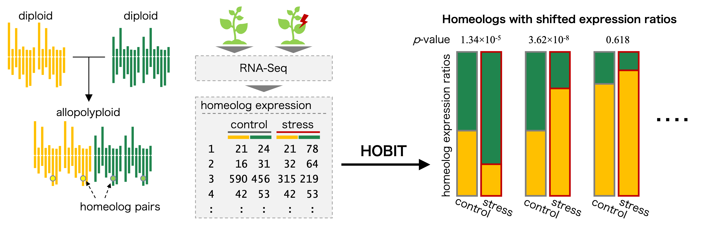

# hespresso {-}


`r pkg("hespresso")` blends _homeolog expression_ &#129516; with _espresso_ &#9749;,
capturing the essence of power, energy, and focus in homeolog expression analysis.
It provides statistical tests for detecting shifts in homeolog expression ratios
among subgenomes of allopolyploid species
across diverse conditions, using RNA-seq read count data.
Take a sip of `r pkg('hespresso')` &#9749;, and start your analysis strong!

<div style="margin:3em 0;">
```{r hobit-image, echo=FALSE, out.width='100%', fig.align='center'}

```
</div>

---

Allopolyploids arise through hybridization between two or more related species
and contain multiple sets of chromosomes derived from distinct progenitors,
referred to as subgenomes.
Genes duplicated across these subgenomes, termed homeologs,
provide opportunities for functional diversification [@ref_polyploid_genomeevo].
By modulating the balance of homeolog expression,
allopolyploids can respond flexibly to developmental and environmental changes [@ref_polyploid_hexpexchange].
This plasticity is thought to enhance their adaptability and
may allow them to occupy broader ecological niches
than their progenitors [@ref_robustgeneral; @ref_polyploid_stresstolerance].

For example, Akama et al. and Paape et al. reported that
a small proportion of homeologs in _Arabidopsis kamchatica_ (2*n* = 4*x* = 32, HHLL),
an allotetraploid derived from _Arabidopsis halleri_ (2*n* = 2*x* = 16, HH)
and _Arabidopsis lyrata_ (2*n* = 2*x* = 16, LL),
exhibited shifts in expression ratios under cold and zinc stress,
respectively [@ref_homeoroq; @ref_kamzinc].
Similarly, Akiyama et al. found that
the allotetraploid _Cardamine flexuosa_ (2*n* = 4*x* = 32, HHAA),
derived from _Cardamine hirsuta_ (2*n* = 2*x* = 16, HH) and
_Cardamine amara_ (2*n* = 2*x* = 16, AA),
displays distinct patterns of homeolog expression ratios
across ecological habitats [@ref_cflex_ecohabitats].
Therefore, detecting such changes is essential for understanding
the regulatory mechanisms underlying allopolyploid evolution and adaptation.

The `r pkg("hespresso")` package provides statistical tools
to detect homeologs with shifted expression ratios
across diverse experimental conditions using RNA-seq data from allopolyploid species.
It implements two methods: HOBIT [@ref_hobit] and HomeoRoq [@ref_homeoroq].
HOBIT offers broad applicability, accommodating polyploid systems
with uneven (e.g., allotriploids) or complex subgenome compositions (e.g., allohexaploids like wheat),
and supports hypothesis testing across multiple conditions.
In contrast, HomeoRoq is tailored for detecting ratio shifts between two conditions in allotetraploids.
Benchmarking with simulated data indicates that
HOBIT achieves a more balanced trade-off between precision and recall,
yielding higher AUC and F1 scores,
whereas HomeoRoq favors higher precision at the cost of reduced recall [@ref_hobit].
Whether applied to tissues, developmental stages, stress treatments, or ecological habitats,
`r pkg("hespresso")` provides the statistical power and flexibility
required for robust homeolog expression analysis.

Insights demand curiosity, endurance demands coffee;
`r pkg("hespresso")` delivers both &#9749;.
